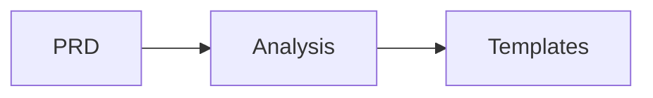

# Marvin Documentation

This directory contains the source files for Marvin's documentation, built with [MkDocs](https://www.mkdocs.org/) and the [Material theme](https://squidfunk.github.io/mkdocs-material/).

## 📁 Documentation Structure

```
docs/
├── index.md                    # Homepage
├── getting-started/           # Installation and setup guides
│   ├── installation.md
│   ├── quickstart.md
│   └── configuration.md
├── user-guide/               # End-user documentation
│   ├── processing-prds.md
│   ├── templates.md
│   ├── cli-usage.md
│   ├── api-usage.md
│   └── ai-integration.md
├── architecture/             # System design documentation
│   ├── overview.md
│   ├── hexagonal.md
│   ├── agents.md
│   └── data-flow.md
├── developer-guide/          # Developer documentation
│   ├── setup.md
│   ├── tdd-workflow.md
│   ├── testing.md
│   ├── code-quality.md
│   └── contributing.md
├── api/                      # API reference (auto-generated)
│   ├── domain.md
│   ├── agents.md
│   ├── use-cases.md
│   └── rest-api.md
├── includes/                 # Reusable content
│   └── abbreviations.md
├── stylesheets/             # Custom CSS
│   └── extra.css
├── javascripts/             # Custom JavaScript
│   └── extra.js
├── assets/                  # Images, logos, etc.
└── overrides/               # Theme overrides
```

## 🚀 Local Development

### Prerequisites

Install documentation dependencies:

```bash
# Using uv (recommended)
uv pip install -e ".[docs]"

# Or using pip
pip install -e ".[docs]"
```

### Running Locally

Start the development server:

```bash
# Using MkDocs directly
mkdocs serve

# With live reload on all file changes
mkdocs serve --livereload

# On a different port
mkdocs serve --dev-addr localhost:8080
```

The documentation will be available at http://localhost:8000

### Building Documentation

Build static files:

```bash
# Build documentation
mkdocs build

# Build with strict mode (fails on warnings)
mkdocs build --strict

# Clean build (removes old files first)
mkdocs build --clean
```

The built documentation will be in the `site/` directory.

## 📝 Writing Documentation

### Adding New Pages

1. Create a new `.md` file in the appropriate directory
2. Add the page to the navigation in `mkdocs.yml`:

```yaml
nav:
  - Section:
    - Page Title: section/page.md
```

### Markdown Extensions

We use several markdown extensions for enhanced functionality:

#### Admonitions

```markdown
!!! note "Optional Title"
    This is a note admonition.

!!! warning
    This is a warning without a custom title.

??? info "Collapsible Info"
    This admonition is collapsible.
```

#### Code Blocks

````markdown
```python title="example.py" linenums="1" hl_lines="2 3"
def process_prd(prd_path: str) -> List[Task]:
    # Highlighted lines
    tasks = analyze_document(prd_path)
    return tasks
```
````

#### Tabs

```markdown
=== "Python"
    ```python
    marvin.process("prd.md")
    ```

=== "CLI"
    ```bash
    marvin process prd.md
    ```
```

#### Mermaid Diagrams

```markdown

```

### API Documentation

API documentation is auto-generated from docstrings using mkdocstrings:

```markdown
::: marvin.core.domain.models
    options:
      show_source: true
      heading_level: 2
```

## 🚢 Deployment

### GitHub Pages

Documentation is automatically deployed to GitHub Pages when changes are pushed to the `main` branch.

The GitHub Actions workflow (`.github/workflows/docs.yml`) handles:

1. Building the documentation
2. Running validation checks
3. Deploying to GitHub Pages

### Manual Deployment

If needed, you can manually deploy:

```bash
# Build and deploy to gh-pages branch
mkdocs gh-deploy

# Deploy with custom commit message
mkdocs gh-deploy -m "Update documentation"

# Force push (overwrites gh-pages branch)
mkdocs gh-deploy --force
```

## 🔧 Configuration

Main configuration is in `mkdocs.yml`:

- **Theme settings**: Colors, fonts, features
- **Plugins**: Search, mkdocstrings, git info
- **Extensions**: Markdown enhancements
- **Navigation**: Site structure

## 📚 Resources

- [MkDocs Documentation](https://www.mkdocs.org/)
- [Material for MkDocs](https://squidfunk.github.io/mkdocs-material/)
- [mkdocstrings](https://mkdocstrings.github.io/)
- [PyMdown Extensions](https://facelessuser.github.io/pymdown-extensions/)

## 🤝 Contributing to Docs

When contributing to documentation:

1. Follow the existing structure and style
2. Test locally before submitting PR
3. Ensure no broken links
4. Update navigation if adding new pages
5. Add appropriate metadata (descriptions, tags)

### Style Guide

- Use clear, concise language
- Include code examples where relevant
- Add diagrams for complex concepts
- Keep paragraphs short
- Use appropriate heading levels
- Include links to related content

## 🐛 Troubleshooting

### Common Issues

**Build fails with "strict mode" errors:**
- Check for broken internal links
- Ensure all referenced files exist
- Fix any markdown syntax errors

**Styles not updating:**
- Clear browser cache
- Restart mkdocs serve
- Check CSS syntax

**API docs not generating:**
- Ensure docstrings follow Google style
- Check module imports
- Verify mkdocstrings configuration