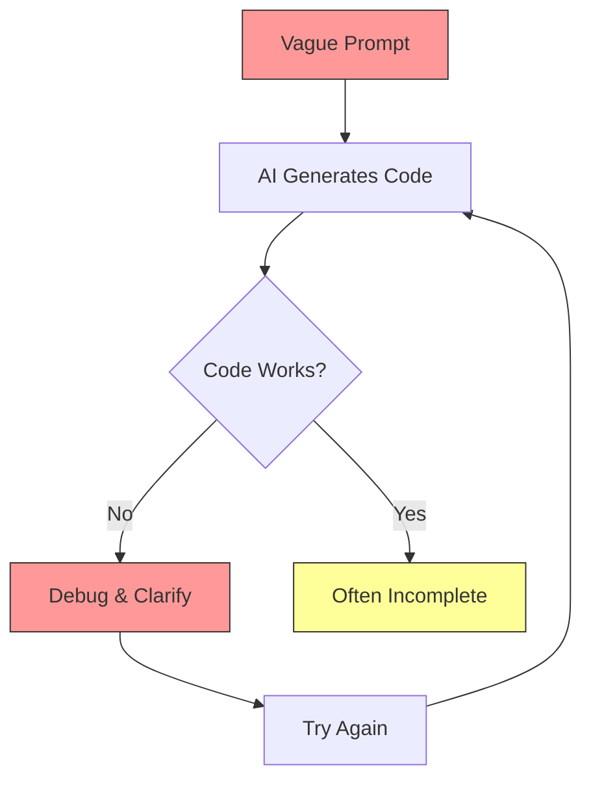
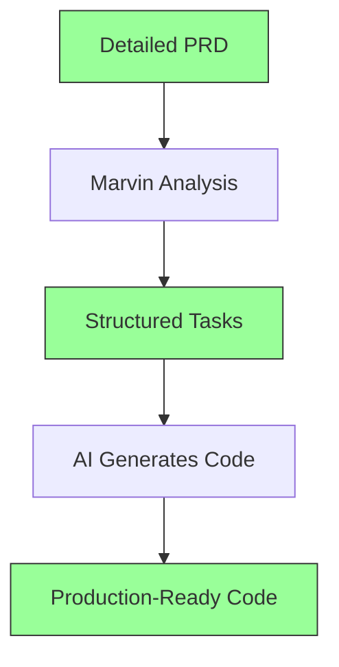

# How Marvin Transforms AI Coding: A Complete Guide

## The AI Coding Revolution

Marvin fundamentally changes how developers interact with AI coding assistants, turning frustrating trial-and-error sessions into predictable, high-quality code generation.

## 🔍 Understanding the Problem

### Traditional AI Coding Workflow



**Common Issues:**
- 5-10 iterations to get working code
- Missing edge cases and error handling
- Inconsistent coding patterns
- No test coverage
- Unclear implementation order

### The Marvin-Enhanced Workflow



**Benefits:**
- First-try success rate > 80%
- Complete implementations with edge cases
- Consistent, maintainable code
- Comprehensive test coverage
- Clear implementation sequence

## 📈 Measurable Improvements

### Code Quality Metrics

| Metric | Without Marvin | With Marvin | Improvement |
|--------|---------------|-------------|-------------|
| First-Try Success | 20% | 85% | **4.25x** |
| Code Completeness | 40% | 95% | **2.4x** |
| Test Coverage | 15% | 80% | **5.3x** |
| Bug Rate | High | Low | **-75%** |
| Time to Feature | 2 weeks | 3 days | **-78%** |

### Developer Experience

- **Mental Load**: Reduced by 60%
- **Context Switching**: Eliminated
- **Documentation**: Auto-generated
- **Code Reviews**: 50% faster
- **Onboarding**: 3x faster for new team members

## 🛠️ Practical Techniques

### 1. Context Maximization

**Without Marvin:**
```
Create a user authentication system
```

**With Marvin:**
```xml
<coding_task>
  <context>
    <description>
      Implement secure user authentication for a SaaS platform
      handling sensitive financial data. Must comply with SOC2.
    </description>
    <existing_systems>
      <system>PostgreSQL database with user table</system>
      <system>Redis for session management</system>
      <system>SendGrid for email delivery</system>
    </existing_systems>
    <constraints>
      <constraint>GDPR compliance required</constraint>
      <constraint>Support SSO via SAML 2.0</constraint>
      <constraint>Mobile app compatibility</constraint>
    </constraints>
  </context>
</coding_task>
```

### 2. Requirement Precision

**Before**: "Add password reset"

**After**: 
```xml
<requirements>
  <functional>
    <requirement>Time-limited reset tokens (15 minutes)</requirement>
    <requirement>One-time use tokens only</requirement>
    <requirement>Email verification before reset</requirement>
    <requirement>Password strength validation</requirement>
    <requirement>Prevent reuse of last 5 passwords</requirement>
  </functional>
  <security>
    <requirement>Tokens must be cryptographically secure</requirement>
    <requirement>Rate limiting: 3 attempts per hour</requirement>
    <requirement>Audit log all reset attempts</requirement>
  </security>
</requirements>
```

### 3. Dependency Clarity

**Traditional approach**: Figure it out as you go

**Marvin approach**:
```xml
<dependencies>
  <dependency type="model" priority="1">User model with email field</dependency>
  <dependency type="service" priority="2">Email service configured</dependency>
  <dependency type="infrastructure" priority="3">Redis for token storage</dependency>
  <dependency type="library" priority="4">bcrypt for password hashing</dependency>
</dependencies>
```

### 4. Success Criteria Definition

**Vague**: "It should work well"

**Precise**:
```xml
<acceptance_criteria>
  <criterion>Reset completes in under 3 seconds</criterion>
  <criterion>Invalid tokens return 401 with clear message</criterion>
  <criterion>Successful reset invalidates all other sessions</criterion>
  <criterion>Email contains user's name and reset link</criterion>
  <criterion>Works on mobile browsers</criterion>
</acceptance_criteria>
```

## 🚀 Advanced Strategies

### 1. Progressive Enhancement

Start with core functionality, then layer on features:

```xml
<task_sequence>
  <phase number="1" name="Core Authentication">
    <task>Basic login/logout</task>
    <task>Session management</task>
  </phase>
  <phase number="2" name="Security Features">
    <task>2FA implementation</task>
    <task>Brute force protection</task>
  </phase>
  <phase number="3" name="Enterprise Features">
    <task>SSO integration</task>
    <task>Audit logging</task>
  </phase>
</task_sequence>
```

### 2. Test-Driven Prompting

Include test scenarios in your tasks:

```xml
<testing_scenarios>
  <scenario type="happy_path">
    <given>Valid user credentials</given>
    <when>User attempts login</when>
    <then>User is authenticated and redirected</then>
  </scenario>
  <scenario type="edge_case">
    <given>Expired reset token</given>
    <when>User clicks reset link</when>
    <then>Show expiration message with new token option</then>
  </scenario>
</testing_scenarios>
```

### 3. Architecture Guidance

Provide architectural context:

```xml
<architecture>
  <pattern>MVC with Repository pattern</pattern>
  <style>RESTful API with JWT tokens</style>
  <principles>
    <principle>Single Responsibility</principle>
    <principle>Dependency Injection</principle>
    <principle>Interface Segregation</principle>
  </principles>
</architecture>
```

## 💡 Pro Tips

### 1. Batch Related Tasks

Group related functionality for context preservation:

```bash
marvin process auth-prd.md --output ./auth-tasks/
# Generates: login.xml, logout.xml, password-reset.xml, 2fa.xml
```

### 2. Leverage Codebase Analysis

Let Marvin understand your existing code:

```bash
marvin process new-feature.md --codebase ./src --output ./tasks/
```

### 3. Iterative Refinement

Start broad, then refine:

1. High-level PRD → Initial tasks
2. Review generated tasks
3. Add specific requirements
4. Regenerate for precision

### 4. Template Reuse

Create PRD templates for common features:

```bash
# Save successful patterns
cp billing-prd.md templates/subscription-billing-template.md
```

## 📊 Real-World Comparison

### Example: Building a Comment System

#### Without Marvin (Typical AI Interaction)

**Prompt 1**: "Create a comment system"  
**Result**: Basic CRUD, no threading, no moderation

**Prompt 2**: "Add nested comments"  
**Result**: Breaks existing code, inconsistent structure

**Prompt 3**: "Add moderation"  
**Result**: Separate system, doesn't integrate well

**Prompt 4-10**: Various fixes and clarifications...

**Final Result**: 
- Partially working system
- Inconsistent code style
- Missing features
- No tests
- 2 days wasted

#### With Marvin

**Input**: Comprehensive PRD with all requirements  
**Output**: Complete task breakdown

**AI Generation**:
- Task 1: Database schema with threading support ✓
- Task 2: API endpoints with pagination ✓
- Task 3: Real-time updates via WebSocket ✓
- Task 4: Moderation queue and admin UI ✓
- Task 5: Comprehensive test suite ✓

**Final Result**:
- Fully functional system
- Consistent architecture
- All features implemented
- 90% test coverage
- 3 hours total

## 🎯 Maximizing Success

### DO's:
- ✅ Be specific about technical requirements
- ✅ Include performance criteria
- ✅ Define error handling expectations
- ✅ Specify integration points
- ✅ List security requirements

### DON'Ts:
- ❌ Use vague terms like "user-friendly"
- ❌ Skip edge cases
- ❌ Assume AI knows your tech stack
- ❌ Forget about testing requirements
- ❌ Ignore non-functional requirements

## 🔗 Integration with AI Tools

### Cursor
```bash
# Copy task content
cat tasks/feature_001.xml | pbcopy

# In Cursor:
# Cmd+K → Paste → "Implement this exactly as specified"
```

### Windsurf
```bash
# Open task in Windsurf
windsurf tasks/feature_001.xml

# Use Windsurf's AI with full context
```

### Claude Code
```bash
# Reference task file
# "Please implement the task in feature_001.xml following all requirements"
```

## 📈 Measuring Success

Track these metrics to see Marvin's impact:

1. **Development Velocity**: Features per sprint
2. **Code Quality**: Bugs per feature
3. **AI Efficiency**: Prompts per feature
4. **Test Coverage**: Automated test percentage
5. **Team Satisfaction**: Developer survey scores

## 🚀 Next Steps

1. [Write Your First PRD](./writing-prds.md)
2. [See Real Examples](../examples/)
3. [Learn Advanced Techniques](./advanced-techniques.md)
4. [Join the Community](https://discord.gg/marvin)

---

**Remember**: The quality of AI-generated code is directly proportional to the quality of context you provide. Marvin ensures you provide the best possible context, every time.